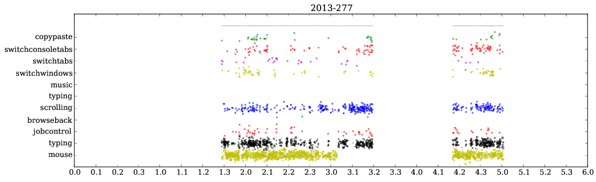

Workflow Copilot and User Interaction Profiler
====================================================

About
------

 * This is a copilot for your workflow, which removes distractions when you are 
   concentrating, and pushes notifications to you when you are idle.
 * It also can be used to record your computer interaction and make neat plots.

For Linux/X.

How
-----

These scripts 

* measure the interactivity by keystrokes and mouse movement
* classify this information into types such as text typing, scrolling web pages, editing text, switching between windows

   
   Example of profiled user interaction. You see times without interaction, 
   times of no data (no grey line on top), then the various classes currently defined.
   At the bottom is the amount of text typed and mouse distance spent.
   The time granularity for this classification was 5 seconds.

Using simple logic, they profile the interaction to detect when you are free to
be interrupted with notifications, when emails should be checked.

Obviously, this has to be tailored to your own workflow.
The actions should be defined in the script "./interact" (not included). See interact.py.

Running
---------

The copilot script::

    sudo evtest /dev/input/by-path/platform-i8042-serio-0-event-kbd | python -u live.py

will append to live.log.

The plotting script::

    python analyse.py live.log

